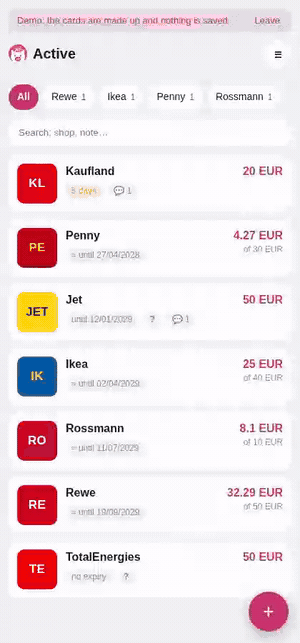

# 🐷 Gutschwein

A family gift-card manager: what is left on each card, who spent what, and a screen the
cashier can scan. Runs as a Telegram Mini App and as an installable PWA.

*Gutschein* (voucher) + *Schwein* (pig) — the piggy bank you keep your vouchers in.



**[Try the demo](https://spar-schwein.duckdns.org/demo)** — made-up cards, no account, nothing saved.

## Run it yourself

No Telegram account, no bot, no configuration — the demo dataset is enough to see every
screen:

```bash
git clone https://github.com/MarvinParanoid/Gutschwein && cd Gutschwein
cp .env.example .env
docker compose up -d --build
# then open http://localhost:8000/demo
```

For a real installation you need a bot token and a public HTTPS domain: see
[docs/deploy.md](docs/deploy.md). It can also run [without Telegram
entirely](docs/deploy.md#members-without-telegram), with login links handed out from the
server console.

## The flow it is built around

A gift card with money on it gets spent over several trips:

1. open the app, find the shop (list or search);
2. tap the picture — it fills the screen on white, and the cashier scans it;
3. tap *Update balance* and type either what you paid or what the receipt says is left.

When the balance hits zero the card moves itself to *Spent*. Every payment lands in the
card's history: who, how much, when, and what for.

## What it does

- **Lists** by tab: active (soonest expiry first), drafts, spent, archive
- **Balance** with *spent* / *remaining* entry and a log. Fixing a typo is just another
  update — both entries stay in the history
- **Scan mode**: white background, full-width image, rotation. A barcode decoded from the
  screenshot is redrawn as SVG, so it stays sharp at any zoom
- **Adding**: send the bot a photo captioned "Rewe 50", or fill the form in the app
- **Expiry** guessed from the shop's rule when the card prints none — three years, or the
  end of the third calendar year (§199 BGB). A guess is marked "≈" so it never reads as a
  printed date, and the chat gets a reminder three days before
- **Comments** shared with the family, **history** of every change, **statistics** with a
  six-month chart
- **Into the family chat**: new card, payment with the remainder, new comment, an expiry
  reminder, a weekly digest and a nightly backup file
- **Three languages** — English, German, Russian — picked automatically, no switch to set

## Stack

| Layer | What |
|---|---|
| API | FastAPI, SQLAlchemy 2 (async), SQLite, Alembic |
| Bot | aiogram 3, long polling, same process |
| Frontend | React + TypeScript + Vite, served as static files by FastAPI |
| Auth | Telegram `initData` (HMAC) or a one-time link; a session cookie for the PWA |
| Deploy | Docker, one container, a `./data` volume |

## Local development

```bash
make install          # venv + npm install
make dev-api          # FastAPI :8000, DEV_MODE=true, bot off
make dev-web          # Vite :5173, proxies /api to :8000
make test             # pytest
make lint             # ruff + tsc
make migration m="…"  # alembic revision --autogenerate
```

Outside Telegram there is no `initData`, so in development the frontend sends
`X-Dev-User: 1000` and the backend accepts it only while `DEV_MODE=true`.
**In production `DEV_MODE` must be `false`** — otherwise the app is open to anyone.

End-to-end tests run against the built bundle served by FastAPI:

```bash
cd frontend && npm run build && npx playwright test
```

## Documentation

- [docs/deploy.md](docs/deploy.md) — putting it on a server: bot setup, reverse proxy,
  backups and a rehearsed restore, members without Telegram, and the traps a real VPS
  turned up
- [docs/internals.md](docs/internals.md) — how the demo, the languages and the access
  model work, and what to know before changing them

## Not built, on purpose

No OCR or vision recognition: after buying a card the two actions are "screenshot" and
"type the shop and the amount", and a recogniser has to beat that. No groups, households or
invites, no manual language switch. The model is recognition-ready (every field is
optional), but nothing fills it in automatically.

Maybe later: recognising the fields after all, a push aimed at one person rather than the
whole chat, Postgres if the data ever grows (`DATABASE_URL` is already external).

## Licence

MIT — see [LICENSE](LICENSE). The merchant tiles are drawn from initials and colours on
purpose: no third-party logos are shipped, so nothing here carries someone else's
trademark.
