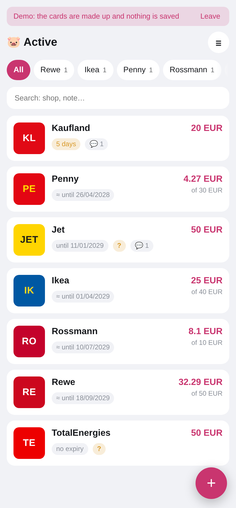
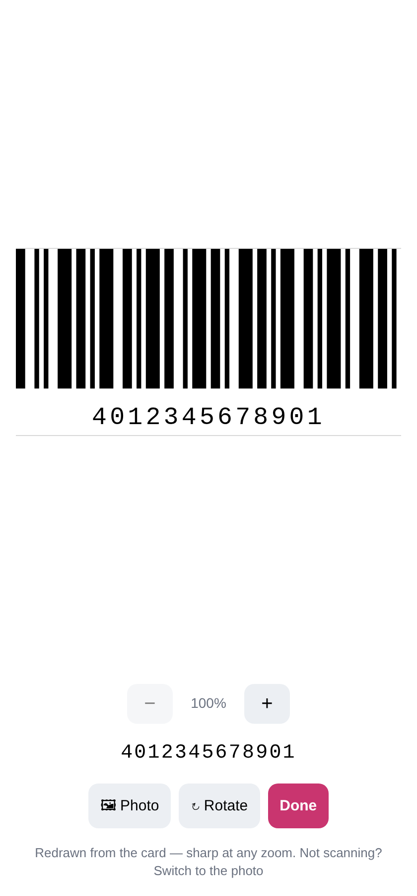
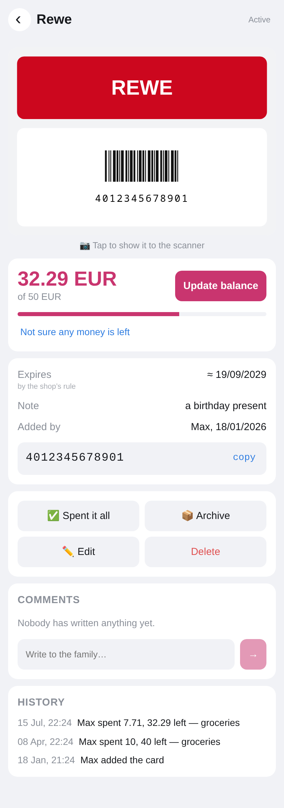
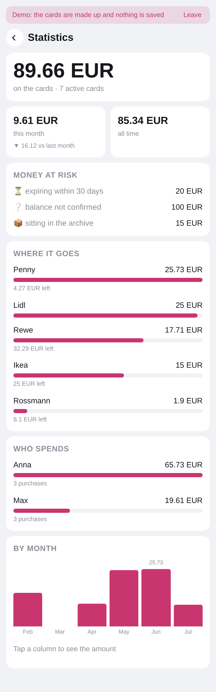
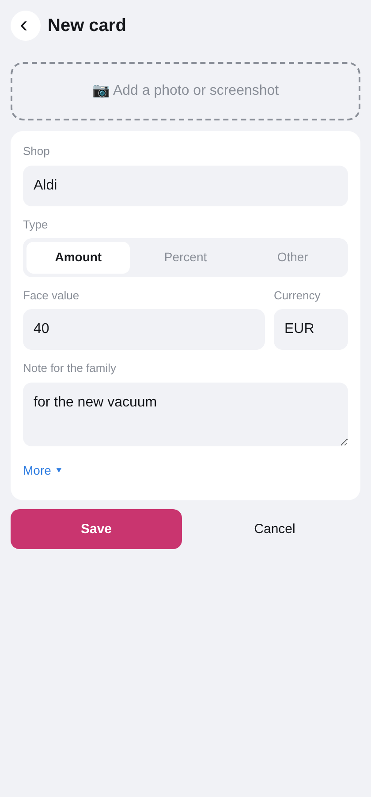
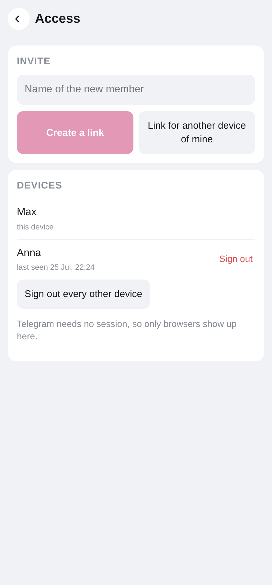
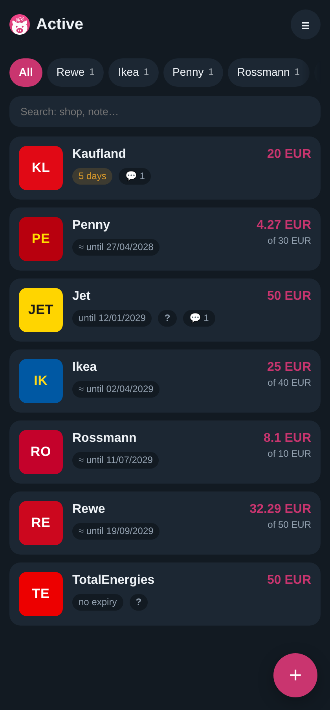

# Gutschwein

[](https://github.com/MarvinParanoid/Gutschwein/actions/workflows/ci.yml)
[](LICENSE)
[](https://github.com/MarvinParanoid/Gutschwein/pkgs/container/gutschwein)

**A self-hosted gift card wallet for families.**

Keep every gift card in one place, track the remaining balance, see who spent what, and
show barcodes directly from your phone at checkout.

Runs as an installable **PWA**, with **optional Telegram integration**.

*Gutschein* (voucher) + *Schwein* (pig) — the piggy bank you keep your vouchers in.

---

## Highlights

- 🏠 Self-hosted
- 📱 Installable PWA
- 👨‍👩‍👧 Shared family wallet
- 💳 Track balances and spending history
- 📷 Barcode scan mode for checkout
- ⏰ Expiry reminders
- 🐳 Docker image on GHCR
- 🌍 English, German and Russian


## 🚀 Try the demo

**https://gutschwein.duckdns.org/demo**

No account.

No Telegram.

Nothing is saved.

---

## Run it yourself

Runs in under a minute using the published Docker image.

```bash
git clone https://github.com/MarvinParanoid/Gutschwein
cd Gutschwein

cp .env.example .env

# The container runs as uid 10001, and docker would create ./data as root.
mkdir -p data && sudo chown -R 10001:10001 data

docker compose pull
docker compose up -d

# open http://localhost:8000/demo
```

Nothing is built locally. Skip the `chown` and the app says so on startup instead of
starting; the deployment guide explains why in more detail.

The image is `linux/amd64` only for now. On ARM — a Raspberry Pi or an ARM server — build
from source instead, which is also what you want while changing anything:

```bash
docker compose up -d --build
```

A real installation needs a public HTTPS domain: a PWA will not install without one, and
Telegram opens a Mini App over nothing else. See [docs/deploy.md](docs/deploy.md).

A bot token is needed only for the Telegram half — the Mini App, adding a card by
screenshot, and everything the family chat delivers. Without one the app still runs: the
first member is created from the server console, and after that *Access* mints one-time
login links for a new member or for another of your own devices, and lists every signed-in
browser with a way to sign one out.

---

## Typical usage

Gift cards are usually spent over several shopping trips.

1. Find the card.
2. Show the barcode to the cashier.
3. Enter either the amount you spent or the remaining balance shown on the receipt.

When the balance reaches zero the card automatically moves to **Spent**.

Every transaction is stored in the card history together with:

- who paid,
- how much,
- when,
- and an optional note.

---

## Features

### Wallet

- Active, Drafts, Spent and Archive tabs
- Active cards sorted by nearest expiry
- Fast search
- Manual archive

### Balance & History

- Track remaining balance
- Record either **spent** or **remaining**
- Complete transaction history
- Corrections never overwrite previous entries

### Checkout

- White fullscreen scan mode
- Full-width barcode
- Zoom, and a rotate button for cards printed sideways
- SVG barcode rendering for crisp scaling

### Adding cards

- Send the Telegram bot a screenshot
- Or create cards manually
- Merchant and amount are usually enough

### Expiry

- Uses printed expiry dates when available
- Estimates expiry when none is printed
- German legal defaults supported (§199 BGB)
- Reminder three days before expiry — *Telegram*

### Family

- Shared comments
- Spending history
- Statistics
- Weekly digest — *Telegram*
- Nightly backups — *Telegram*

Everything marked *Telegram* is delivered to the family chat, so without a bot those are
simply off. Note that this leaves a Telegram-less install with no automatic backup: the
nightly archive is a chat message. Back up `./data` yourself.

### Access

- Invite family members
- One-time login links
- Device management
- Remote sign-out

### Languages

- English
- Deutsch
- Русский

Automatically selected from Telegram or the browser.

---

## Screenshots

The demo dataset is used throughout, so every value shown here is fictional.

| | | |
|---|---|---|
| [](docs/screenshots/01-list.png) | [](docs/screenshots/02-scan.png) | [](docs/screenshots/03-card.png) |
| Wallet | Checkout mode | Card details |
| [](docs/screenshots/04-stats.png) | [](docs/screenshots/05-form.png) | [](docs/screenshots/06-access.png) |
| Statistics | Add card | Access |
| [](docs/screenshots/07-dark.png) | | |
| Dark mode | | |

---

## Tech stack

| Layer | Technology |
| --- | --- |
| Backend | FastAPI, SQLAlchemy 2 (async), SQLite, Alembic |
| Frontend | React, TypeScript, Vite |
| Bot | aiogram 3 |
| Authentication | Telegram initData or one-time login links |
| Deployment | Docker, single container |

---

## Local development

```bash
make install                   # venv + npm install
make dev-api                   # FastAPI on :8000, bot off
make dev-web                   # Vite on :5173, proxying /api
make test                      # pytest + vitest
make lint                      # ruff + tsc
make migration m="description" # autogenerate an Alembic revision
```

The two `dev-` targets are servers and stay in the foreground, so they want a terminal each.

Outside Telegram there is no `initData`, so during development the frontend sends
`X-Dev-User: 1000`.

The backend accepts it **only when** `DEV_MODE=true`.

> ⚠️ Never enable `DEV_MODE` in production.

Run end-to-end tests:

```bash
cd frontend
npm run build
npx playwright test
```

---

## Documentation

- [Deployment guide](docs/deploy.md)
- [Architecture and internals](docs/internals.md)

---

## Design decisions

Some features are intentionally missing.

### No OCR

Adding a new card usually takes less than 10 seconds:

1. Take a screenshot.
2. Enter the merchant.
3. Enter the amount.

OCR would need to be both faster and more reliable than that.

### No cloud dependency

Everything runs on your own server.

### No merchant logos

Merchant tiles are generated from colours and initials.

No third-party trademarks are shipped with the application.

### Maybe later

- OCR
- Individual notifications
- PostgreSQL
- Import/export

---

## License

MIT — see [LICENSE](LICENSE).